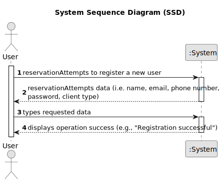

# US01 - Register a user

## 1. Requirements Engineering

### 1.1. User Story Description

As an unregistered user, I want to register a new client.

### 1.2. Customer Specifications and Clarifications 

**From the specifications document:**

> Each client must have a unique identification number, a valid email address, a username and a password. 
> The email address serves as the unique identifier for login. 
> The system must validate the email format and ensure password security (e.g., minimum length, special characters).

**From the client clarifications:**

> **Question:**
>
> **Answer:**

### 1.3. Acceptance Criteria

* **AC1:** Each client is identified by an automatic sequence-generated number.
* **AC2:** The email must be unique for each client.

### 1.4. Found out Dependencies

* There is no found out dependencies.

### 1.5 Input and Output Data

**Input Data:**

* Typed data:
    * name
    * email
    * phone number
    * password
	
* Selected data:
    * client type

**Output Data:**

* Confirmation message (e.g., "Registration successful.")
* Success or failure response with error messages (e.g., "Email already registered", "Invalid password format")

### 1.6. System Sequence Diagram (SSD)

**_Other alternatives might exist._**

### 1.7 Other Relevant Remarks

* 