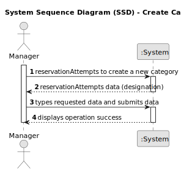

# US003 - Create Category

## 1. Requirements Engineering

### 1.1. User Story Description

As a manager, I want to create new categories so that users can classify their advertisements properly.

### 1.2. Customer Specifications and Clarifications 

**From the specifications document:**

>	Each category is characterized by having a unique id and designation.

### 1.3. Acceptance Criteria

* **AC1:** The category name must be unique
* **AC2:** The category name must have a minimum length of 5 characters (optional)
* **AC3:** The system should validate that the category name is not null or empty.

### 1.4. Found out Dependencies

* N/A

### 1.5 Input and Output Data

**Input Data:**

* Typed data:
    * a designation

**Output Data:**
* (In)Success of the operation

### 1.6. System Sequence Diagram (SSD)

### 1.7 Other Relevant Remarks

* N/A