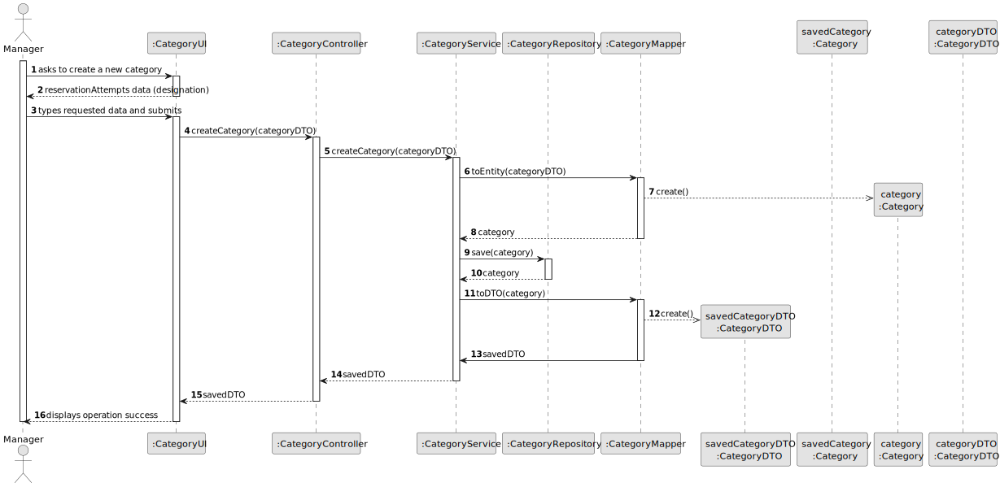
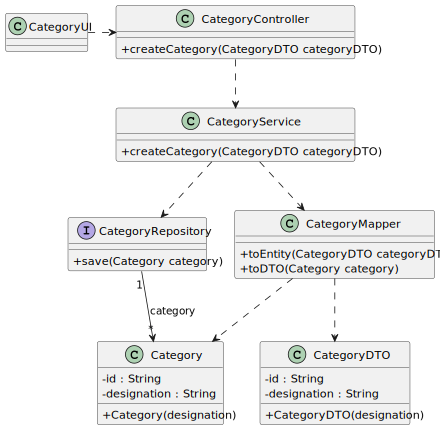

# US03 - Create Category

## 3. Design

### 3.1. Rationale

| Interaction ID | Question: Which class is responsible for...    | Answer             | Justification (with patterns)                                                                                                                                                                                                                                                                                |
|:---------------|:-----------------------------------------------|:-------------------|:-------------------------------------------------------------------------------------------------------------------------------------------------------------------------------------------------------------------------------------------------------------------------------------------------------------|
| Step 1         | ... interacting with the actor?                | CategoryUI         | Pure Fabrication: there is no reason to assign this responsibility to any existing class in the Domain Model.                                                                                                                                                                                                |
|                | ... coordinating the US?                       | CategoryController | Controller                                                                                                                                                                                                                                                                                                   |
| Step 2         | ... requesting data?                           | CategoryUI         | IE: is responsible for user interactions.                                                                                                                                                                                                                                                                    |
| Step 3         | ... saving the inputted data?                  | CategoryUI         | IE: is responsible for keeping the inputted data.                                                                                                                                                                                                                                                            |
|                | ... instantiating a new Category?              | CategoryService    | Pure Fabrication: there is no reason to assign this responsibility to any existing class in the Domain Model.                                                                                                                                                                                                |
|                | ... converting DTO into Entity and vice-versa? | CategoryMapper     | Pure Fabrication / High Cohesion / Low Coupling - CategoryMapper is a Pure Fabrication to handle conversions, ensuring High Cohesion by focusing solely on mapping and Low Coupling by keeping conversion logic separate from Services and Models                                                            |
|                | ... validating all data (local validation)?    | Category           | IE: owns its data.                                                                                                                                                                                                                                                                                           | 
|                | ... validating all data (global validation)?   | CategoryService    | IE: knows all its categories                                                                                                                                                                                                                                                                                 | 
|                | ... saving the created store?                  | CategoryRepository | IE: owns all its categories                                                                                                                                                                                                                                                                                  | 
| Step 6         | ... informing operation success?               | CategoryUI         | IE: is responsible for user interactions.                                                                                                                                                                                                                                                                    | 

### Systematization ##

According to the taken rationale, the conceptual classes promoted to software classes are:

* Store

Other software classes (i.e. Pure Fabrication) identified:

* CategoryController
* CategoryService
* CategoryRepository
* CategoryMapper

## 3.2. Sequence Diagram (SD)

## 3.3. Class Diagram (CD)

