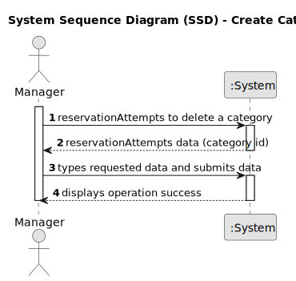

# US06 - Delete category

## 1. Requirements Engineering

### 1.1. User Story Description

As a manager, I want to delete a category so that outdated or irrelevant categories are removed.

### 1.2. Customer Specifications and Clarifications 

**From the specifications document:**

> Each category must have a system generated unique identifier and a designation. 

**From the client clarifications:**

> **Question:**
>
> **Answer:**

### 1.3. Acceptance Criteria

* **AC1:** A category can only be deleted if there are no items in an advertisement associated with it.

### 1.4. Found out Dependencies

* This user story depends on US01 - Log in, as only authenticated users with manager role can delete categories.
* This user story also depends on US04 - View categories list, as the user must be able to see the list of categories to choose which one to delete.

### 1.5 Input and Output Data

**Input Data:**
    * category identifier
	
**Output Data:**

* Confirmation message (e.g., "Deletion successful.")
* Success or failure response with error messages (e.g., "Impossible to delete category.")

### 1.6. System Sequence Diagram (SSD)

### 1.7 Other Relevant Remarks

* 