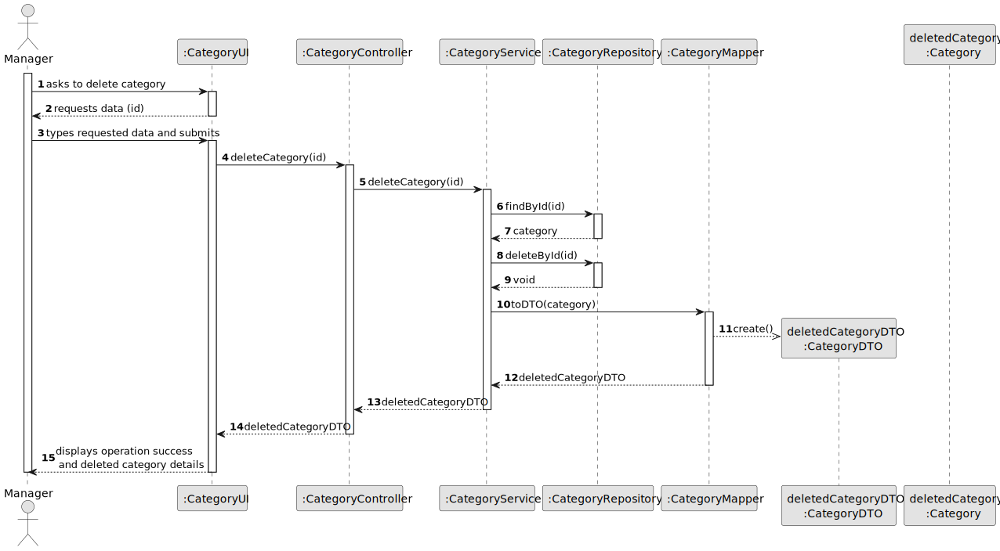
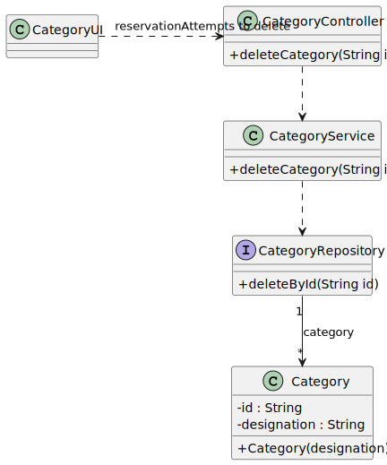

# US006 - Delete a Category

## 3. Design

### 3.1. Rationale

| Interaction ID | Question: Which class is responsible for... | Answer             | Justification (with patterns)                                                                                 |
|:---------------|:--------------------------------------------|:-------------------|:--------------------------------------------------------------------------------------------------------------|
| Step 1         | ... interacting with the actor?             | CategoryUI         | Pure Fabrication: there is no reason to assign this responsibility to any existing class in the Domain Model. |
|                | ... coordinating the US?                    | CategoryController | Controller                                                                                                    |
| Step 2         | ... requesting data?                        | CategoryUI         | IE: is responsible for user interactions.                                                                     |
| Step 3         | ... deleting the category?                  | CategoryRepository | IE: is responsible for persisting/deleting categories.                                                        | 
| Step 4         | ... informing operation success?            | CategoryUI         | IE: is responsible for user interactions.                                                                     | 

### Systematization ##

According to the taken rationale, the conceptual classes promoted to software classes are: 

* Category
* User (role = Manager)

Other software classes (i.e. Pure Fabrication) identified: 

* CategoryUI  
* CategoryController
* CategoryRepository
* CategoryService
* CategoryMapper

## 3.2. Sequence Diagram (SD)

### Full Diagram

This diagram shows the full sequence of interactions between the classes involved in the realization of this user story.

## 3.3. Class Diagram (CD)

