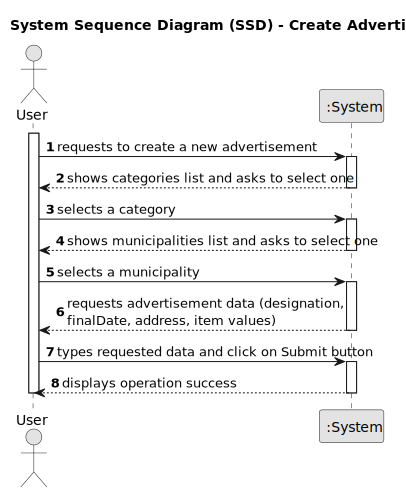

# US01 - Create advertisement

## 1. Requirements Engineering

### 1.1. User Story Description

As a client, I want to create an advertisement so that I can donate an item.

### 1.2. Customer Specifications and Clarifications 

**From the specifications document:**

> Each advertisement must have a designation, an initial date, a final date, an address, a status and the item values. 

**From the client clarifications:**

> **Question:**
>
> **Answer:**

### 1.3. Acceptance Criteria

* **AC1:** Advertisement Status is "available" by default.
* **AC2:** Initial Date is automatically created with the current date.
* **AC3:** The user must provide the item details when creating an advertisement.
* **AC4:** The system must create the associated item together with the advertisement.
* **AC5:** The advertisement must not exist without an associated item.

### 1.4. Found out Dependencies

* This user story depends on US01 - Log in, as only authenticated users can create advertisements.
* This user story also depends on US04 - View categories list, as the user must select a category for the item being donated.

### 1.5 Input and Output Data

**Input Data:**

* Typed data:
    * designation
    * initial date
    * final date
    * address
    * status
    * item designation 
    * item condition
    * item image
	
* Selected data:
    * category

**Output Data:**

* Confirmation message (e.g., "Registration successful.")
* Success or failure response with error messages (e.g., "Impossible to create advertisement")

### 1.6. System Sequence Diagram (SSD)

### 1.7 Other Relevant Remarks

* 