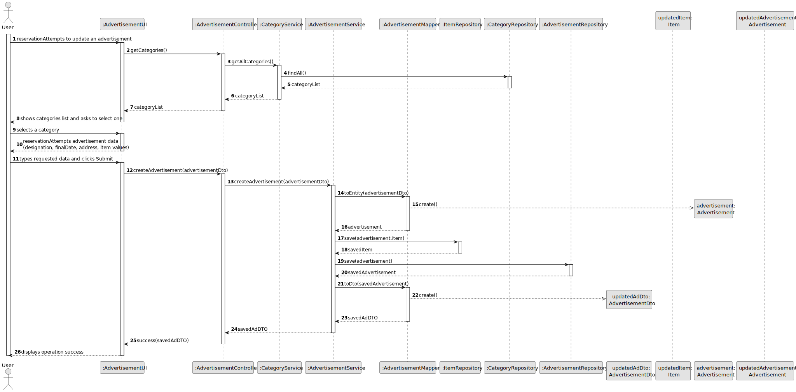
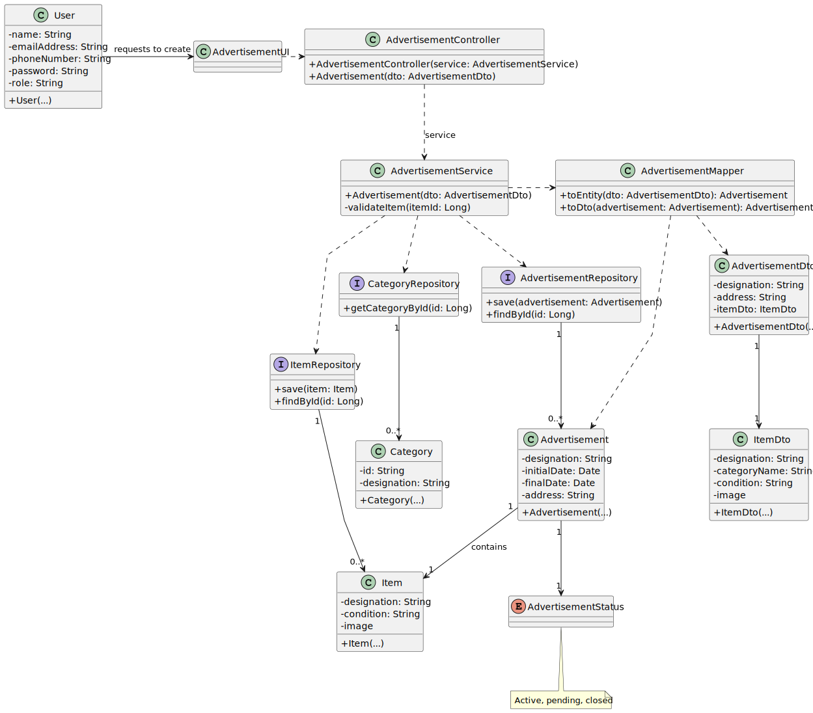

# US007 - Create an Advertisement

## 3. Design

### 3.1. Rationale

| Interaction ID | Question: Which class is responsible for...       | Answer                  | Justification (with patterns)                                                                                 |
|:---------------|:--------------------------------------------------|:------------------------|:--------------------------------------------------------------------------------------------------------------|
| Step 1         | ... interacting with the actor?                   | AdvertisementUI         | Pure Fabrication: there is no reason to assign this responsibility to any existing class in the Domain Model. |
|                | ... coordinating the US?                          | AdvertisementController | Controller                                                                                                    |
| Step 2         | ... knowing all existing categories to show?      | CategoryRepository      | IE: CategoryRepository maintains Item Categories.                                                             |
| Step 3         | ... saving the selected category?                 | AdvertisementUI         | IE: is responsible for keeping the selected category.                                                         |
| Step 4         | ... requesting data?                              | AdvertisementUI         | IE: is responsible for interacting with the user.                                                             |
|                | ... creating the Advertisement?                   | AdvertisementMapper     | Creator (Rule 1): in the DM the Mapper instantiate an Advertisement.                                          |
| Step 5         | ... showing all data and requesting confirmation? | AdvertisementUI         | IE: is responsible for user interactions.                                                                     |              
| Step 6         | ... informing operation success?                  | AdvertisementUI         | IE: is responsible for user interactions.                                                                     | 

### Systematization ##

According to the taken rationale, the conceptual classes promoted to software classes are: 

* User
* Item
* ItemDto
* Category
* AdvertisementDto
* Advertisement
* AdvertisementStatus

Other software classes (i.e. Pure Fabrication) identified: 

* CategoryRepository
* AdvertisementRepository
* ItemRepository
* AdvertisementMapper
* AdvertisementController
* AdvertisementService
* AdvertisementUI

## 3.2. Sequence Diagram (SD)

### Full Diagram

This diagram shows the full sequence of interactions between the classes involved in the realization of this user story.

## 3.3. Class Diagram (CD)

