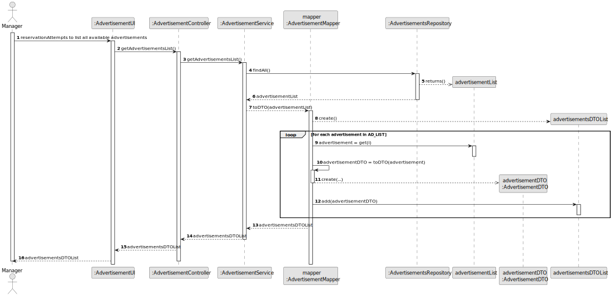
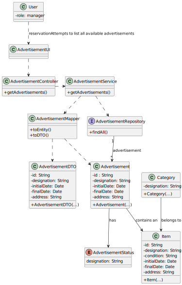

# US08 - View advertisements list

## 3. Design

### 3.1. Rationale

| Interaction ID | Question: Which class is responsible for... | Answer                  | Justification (with patterns)                                                                                 |
|:---------------|:--------------------------------------------|:------------------------|:--------------------------------------------------------------------------------------------------------------|
| Step 1         | ... interacting with the actor?             | AdvertisementUI         | Pure Fabrication: there is no reason to assign this responsibility to any existing class in the Domain Model. |
|                | ... coordinating the US?                    | AdvertisementController | Controller                                                                                                    |
| Step 2         | ... obtain the requested information?       | AdvertisementService    | IE: is responsible for interactions with the repository.                                                      |
| Step 3         | ... instantiating advertisements?           | AdvertisementRepository | Pure fabrication: owns all its categories instances of Request.                                               |
| Step 4         | ... showing all requested information?      | AdvertisementUI         | IE: is responsible for user interactions.                                                                     |

### Systematization ##

According to the taken rationale, the conceptual classes promoted to software classes are:

* Advertisement
* Item

Other software classes (i.e. Pure Fabrication) identified:

* AdvertisementUI
* AdvertisementController
* AdvertisementRepository
* AdvertisementService

## 3.2. Sequence Diagram (SD)

### View Advertisements List Full SD

This diagram shows the full sequence of interactions between the classes involved in the realization of this user story.

## 3.3. Class Diagram (CD)

