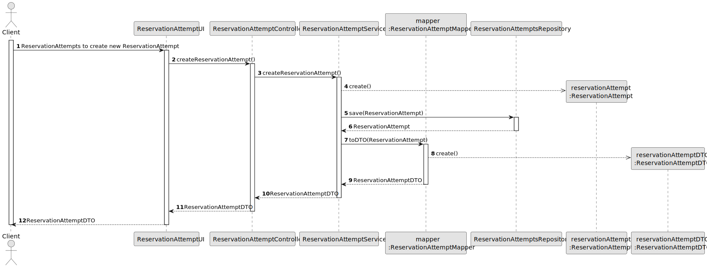
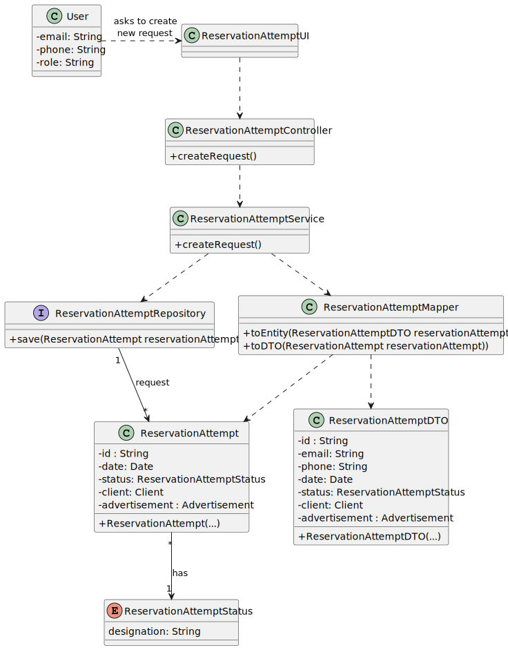

# US16 - Create a ReservationAttempt

## 3. Design

### 3.1. Rationale

| Interaction ID | Question: Which class is responsible for... | Answer                       | Justification (with patterns)                                                                                 |
|:---------------|:--------------------------------------------|:-----------------------------|:--------------------------------------------------------------------------------------------------------------|
| Step 1         | ... interacting with the actor?             | ReservationAttemptUI         | Pure Fabrication: there is no reason to assign this responsibility to any existing class in the Domain Model. |
|                | ... coordinating the US?                    | ReservationAttemptController | Controller                                                                                                    |
| Step 2         | ... instantiating ReservationAttempts?      | ReservationAttemptService    | Creator (Rule 2): ReservationAttemptService instantiates ReservationAttempts.                                 |
| Step 2         | ... recording ReservationAttempt?           | ReservationAttemptRepository | Pure Fabrication: ReservationAttemptRepository records ReservationAttempts.                                   |
|                | ... showing operation success?              | ReservationAttemptUI         | IE: is responsible for user interactions.                                                                     |

### Systematization ##

According to the taken rationale, the conceptual classes promoted to software classes are:

* ReservationAttempt
* Item

Other software classes (i.e. Pure Fabrication) identified:

* ReservationAttemptUI
* ReservationAttemptController
* ReservationAttemptRepository
* ReservationAttemptService

## 3.2. Sequence Diagram (SD)

### View ReservationAttempts List Full SD

This diagram shows the full sequence of interactions between the classes involved in the realization of this user story.

## 3.3. Class Diagram (CD)

