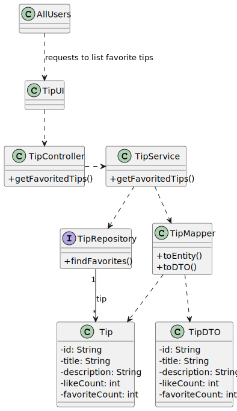

# US08 - View tips list

## 3. Design

### 3.1. Rationale

| Interaction ID | Question: Which class is responsible for...  | Answer        | Justification (with patterns)                                                                                              |
|:---------------|:---------------------------------------------|:--------------|:---------------------------------------------------------------------------------------------------------------------------|
| Step 1         | ... interacting with the actor?              | TipUI         | Pure Fabrication: there is no reason to assign this responsibility to any existing class in the Domain Model.              |
|                | ... coordinating the US?                     | TipController | Controller                                                                                                                 |
| Step 2         | ... obtain the requested information?        | TipService    | IE: is responsible for interactions with the repository.                                                                   |
|                | ... converting Entity to DTO and vice versa? | TipMapper     | Pure Fabrication / High Cohesion / Low Coupling: separates conversion logic, ensuring high cohesion and low coupling       |
| Step 3         | ... instantiating tips?                      | TipRepository | Pure fabrication: owns all its categories instances of Request.                                                            |
|                | ... validating data before displaying?       | TipService    | IE: knows domain rules and can validate data before passing it to the UI.                                                  |
| Step 4         | ... showing all requested information?       | TipUI         | IE: is responsible for user interactions.                                                                                  |

### Systematization ##

According to the taken rationale, the conceptual classes promoted to software classes are:

* Tip

Other software classes (i.e. Pure Fabrication) identified:

* TipUI
* TipController
* TipRepository
* TipService
* TipMapper

## 3.2. Sequence Diagram (SD)

### View Tips List Full SD

This diagram shows the full sequence of interactions between the classes involved in the realization of this user story.

## 3.3. Class Diagram (CD)

